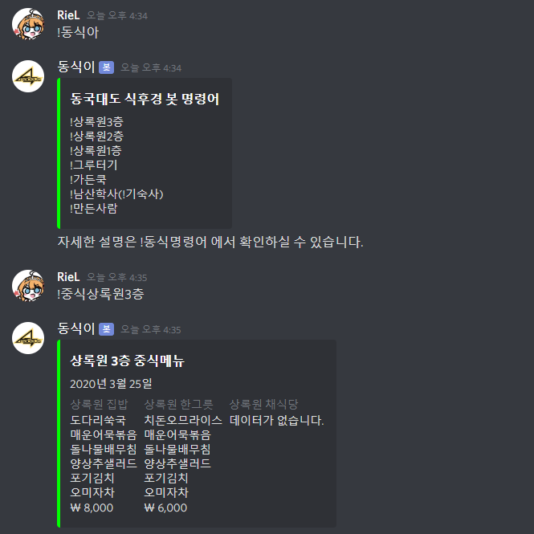
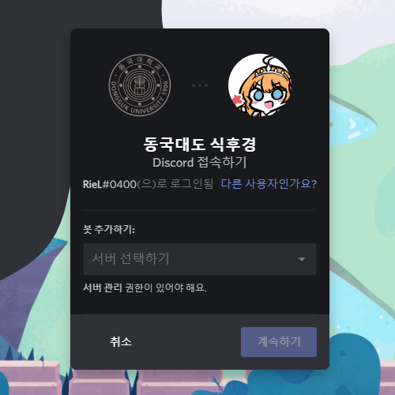

# 동국대도 식후경

[**동국대도 식후경**](https://discordapp.com/oauth2/authorize?client_id=686581468901802035&permissions=67584&scope=bot)은 (줄여서 **동식이**) 동국대학교의 학식을 알려주는 디스코드 봇입니다.



## 시작해볼까요?

기존에 사용하던 카카오톡 동국대학교 응답봇이 api 지원 종료되어 서비스가 없어져서 제가 쓰려고 만들었어요. 우리학교 밥 진짜 맛있거든요 ㅎㅎ (돈치퐁 사주세요 '~')

## 동식이를 서버에 추가하는 방법



동식이는 [이곳에서](https://discordapp.com/oauth2/authorize?client_id=686581468901802035&permissions=67584&scope=bot) 서버에 추가할 수 있습니다!

현재 제 개인서버에서 운영되고 있어요.

## 동식이 명령어 셋

기본적으로 동식이는 사용자가 명령어를 입력한 시간을 기준으로 중식과 석식 데이터를 보내줍니다. 오후 2시 이후에는 석식 데이터에요.

```
!상록원3층
!상록원2층
!상록원1층
!그루터기
!가든쿡
!남산학사(!기숙사)
!만든사람
!동식명령어 
!중식0000 !석식0000 (ex.!중식상록원2층,!석식상록원3층)
!내일0000 (ex.!내일기숙사,!내일석식상록원3층,!내일중식그루터기)
```

## 동식이를 빌드하기 전에!

동식이는 [동국대학교 학식 모듈](https://github.com/sheepjin99/DonggukCafeteria)을 기반으로 만들어졌습니다.  

```
discord
BeautifulSoup
schedule
logging
```
동식이를 빌드하려면 위와 같은 패키지를 미리 설치하셔야 합니다.

## 동식이를 빌드&배치하는 방법

동식이는 서버에서 돌아가는 환경을 전제로 만들어졌습니다.

```
~ git clone https://github.com/sheepjin99/Discord_DGUcafeteria
~ cd Discord_DGUcafeteria
~ nano -e Discord_DGUcafeteria_1.2.0.py
```
이후 client.run('token')을 봇 토큰으로 교체
```
~ python3 Discord_DGUcafeteria_1.2.0.py
```

crontab이나 여타 스케쥴러를 사용할 필요 없이, 동식이는 자동적으로 00:00에 웹페이지를 다시 크롤링해서, 그 날의 학식데이터와 그 다음날의 데이터를 가져옵니다.

## 동식이는 뭘로 만들었냐면요

* [Python 3.7](https://www.python.org/) - 파이떤!
* [Discord.py](https://github.com/Rapptz/discord.py) - 디스코드 봇을 아주 쉽게 만들게끔 해주는 훌륭한 패키지
* [Beautiful Soup](https://www.crummy.com/software/BeautifulSoup/bs4/doc/) - 동국대학교 생활협동조합 모바일 페이지 크롤링

## 디스코드 봇 만드는 방법이 궁금하다면?

[학식 데이터를 크롤링하는 파이썬코드로 디스코드 학식 봇 만들기](https://sheepjin99.tistory.com/21)

## 기여하기

누구나 이슈, 풀리퀘스트를 요청하실 수 있습니다.
기여자 목록은 [여기서](https://github.com/sheepjin99/Discord_DGUcafeteria/graphs/contributors) 확인하실 수 있어요!

## 만든사람

**동국대학교 컴퓨터공학과 19학번 조양진** - [github](https://github.com/sheepjin99), [facebook](https://www.facebook.com/profile.php?id=100014648160911), [tistory](https://sheepjin99.tistory.com/)

## 라이센스

동식이는 MIT 라이센스를 사용합니다. [LICENSE.md](LICENSE.md)를 참고해주세요! 

## Thanks to ...

* 심심했던 방학동안 재밌게 봤던 슈타인즈게이트 제로
* 바보같은 코드를 지적해준 내 트친들
* 훌륭한 패키지(Discord,BS4,Schedule)를 만드신 개발자분들
* 그리고 동식이를 사용해주는 당신♥
